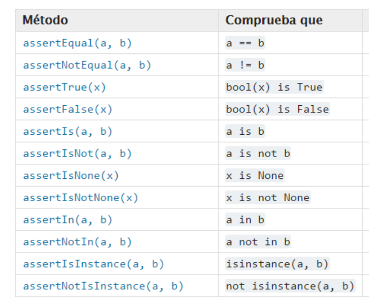

# Para desarrolladores

Crear el venv y instalar las dependencias
```powershell
python -m venv venv
.\venv\Scripts\activate.bat
pip install -r requirements.txt
```
Iniciar el programa
```powersell
python main.py
```
Compilar la interfaz
```powershell
pyuic6 -o nombre_archivo.py nombre_archivo.ui
```

## Documentación


En pycharm ir a: ``File > Settings > Python > Internal Tools > DocStrings``

Selecciona ``reStructuredText``

Genera la configuración de la documentacion:
```powershell
 cd .\docs\
sphinx-apidoc.exe -o source .. -f -e --implicit-namespaces 
```

Ahora, desde la misma carpeta ``docs``, genera la documentación

```powershell
sphinx-build.exe -b html -d .\_build\doctrees\ . .\_build\html
```

## Distribución del programa

Compilar a .exe
```powershell
pyinstaller --onefile --windowed --icon=img/logo.png main.py
```


## Tests unitarios

Ejecutar tests unitarios (carpeta tests)

En pycharm: ``File > Settings > Python > Internal Tools > Testing``

Elegir unittest como motor de tests


```powershell
python -m unittest test.tests
```

Métodos para test
